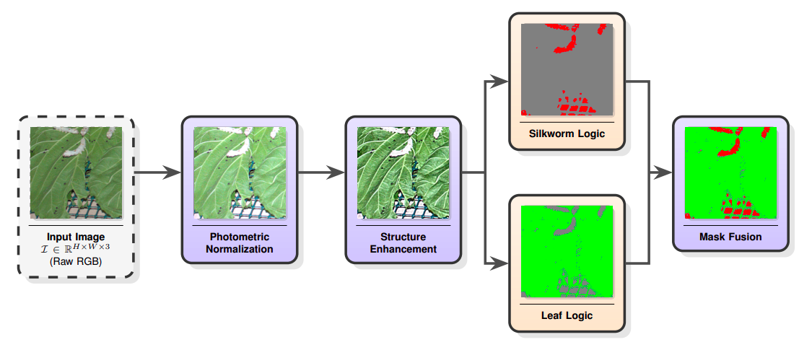
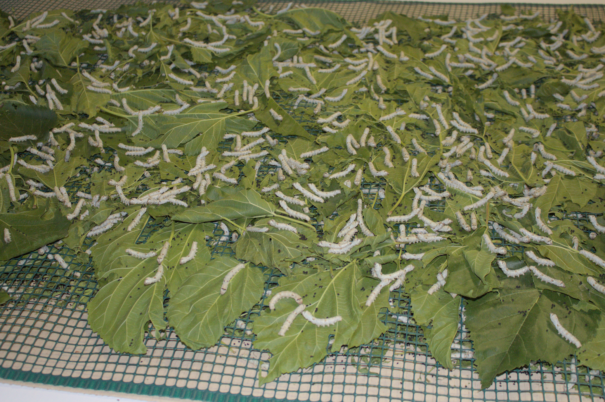
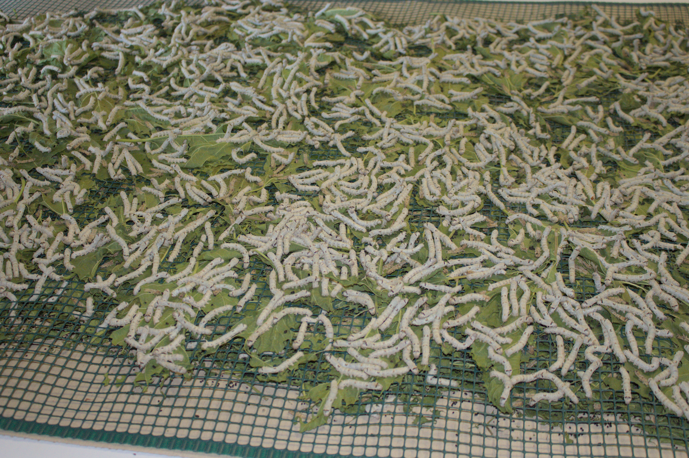
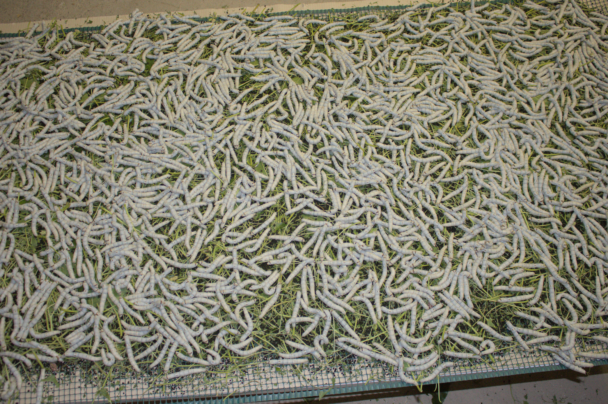
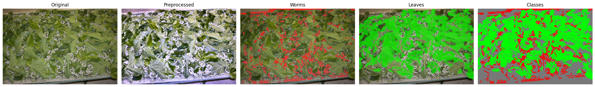
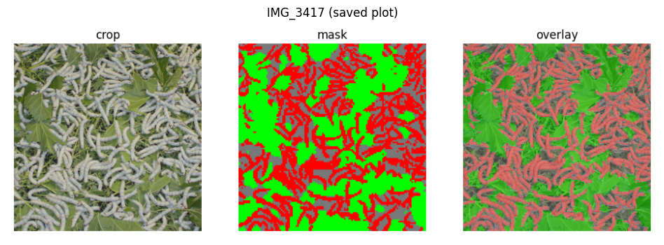
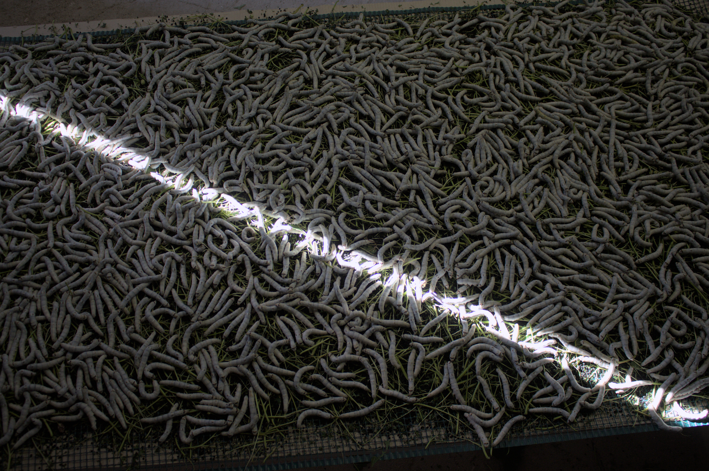
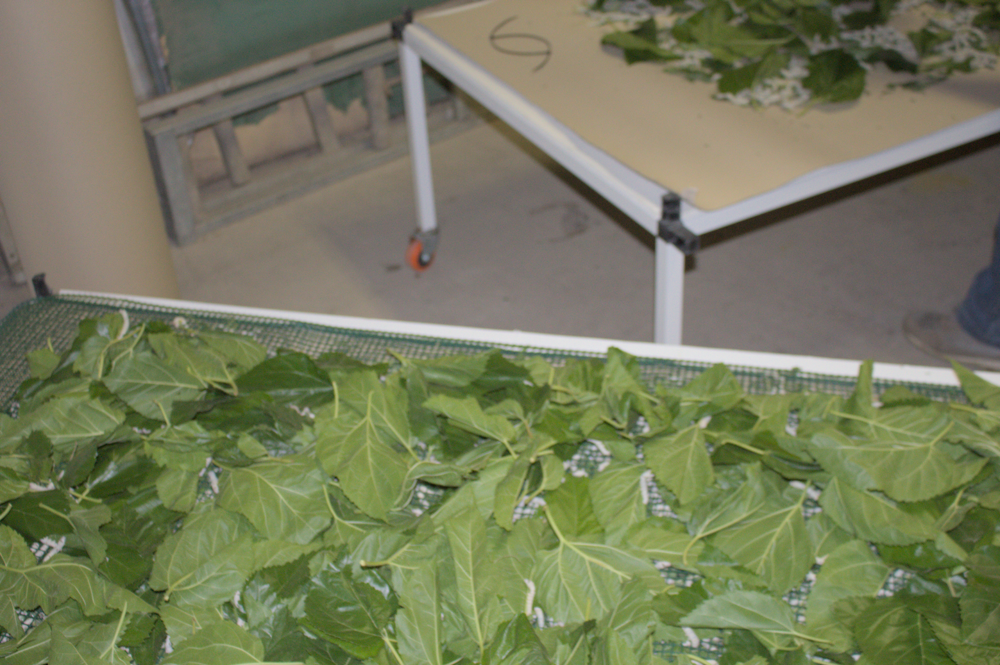
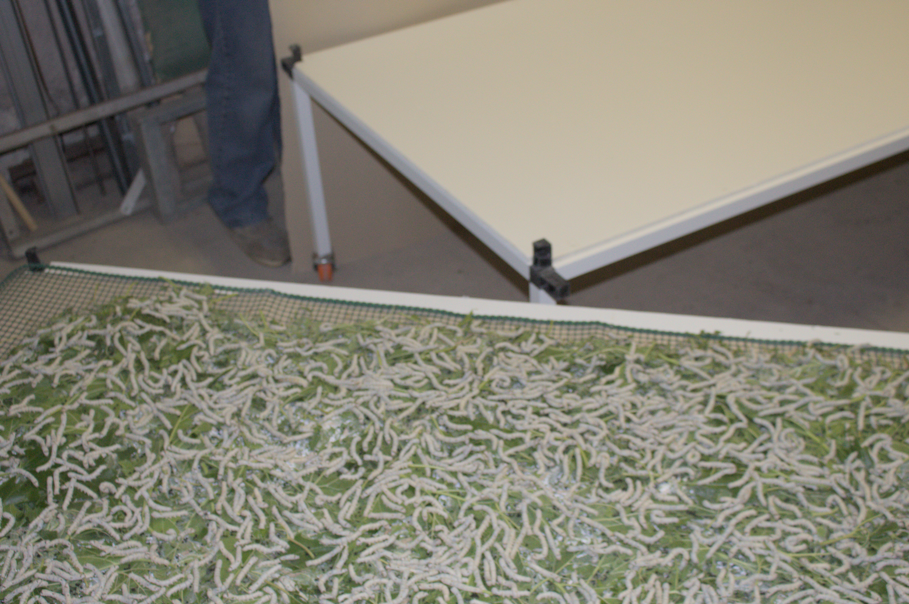

# Efficient Vision for Precision Sericulture: Bridging the Reality Gap in Silkworm Rearing via Interpretable Feature Streams

[](https://alcorlab.diag.uniroma1.it)
[](https://www.tecnoseta.com)

---

<!-- [ALCOR Lab](https://alcorlab.diag.uniroma1.it) & [Tecnoseta](https://www.tecnoseta.com) -->

#### Authors:
> [Leonardo Mariut](www.linkedin.com/in/leonardo-mariut-726a673a8) \
> [Mohamed Zakaria Benjelloun Tuimy](https://it.linkedin.com/in/mohamed-zakaria-benjelloun-tuimy-7a2821226) \
> [Claudio Schiavella](https://gitcharlie00.github.io/PersonalPage/) \
> [Irene Amerini](https://scholar.google.com/citations?user=4ZDhr6UAAAAJ&hl=en) \
> [Massimo Proia](https://it.linkedin.com/in/massimo-proia)

---

#### Paper:

> [Efficient Vision for Precision Sericulture: Bridging the Reality Gap in Silkworm Rearing via Interpretable Feature Streams](https://openreview.net/forum?id=q5zV6M3UI3) - 7th Workshop on Vision for Agriculture, 2026

---

- [Quick overview](#quick-overview)
- [Dataset difficulties](#dataset-difficulties)
- [Examples from the dataset](#examples)
- [Environment setup](#environment-setup)
- [Project structure & reproduction](#project-structure)
- [Link to dataset](#link-to-dataset)

---

### Quick overview

We introduce a novel dataset and a highly efficient vision framework for monitoring when to feed silkworms. To avoid the high costs of manually annotating visually cluttered images, we developed an Environment-Prior Pipeline (EPP) that relies on visual heuristics rather than complex neural networks. Our approach matches the accuracy of heavy Deep Learning baselines but requires drastically less computing power, making it a practical, lightweight solution for real-world agricultural edge devices.


*Environment-prior pipeline*

<!--
#### Tested segmentation models:
> [SegFormer](https://huggingface.co/nvidia/segformer-b0-finetuned-ade-512-512) \
> [U-Net](https://arxiv.org/abs/1505.04597)

#### Tested classification models:
> [EfficientNetV2](https://arxiv.org/abs/2104.00298) \
> [RepNeXt](https://arxiv.org/abs/2406.16004) \
> [MobileViT](https://arxiv.org/abs/2110.02178) \
> [Logistic Regression](2_Quantitative_Analysis/mask_quantitative_analysis.ipynb)
-->

---


### Dataset difficulties

The dataset comes with several challenges that impact both classification and segmentation. 

Camera positioning and framing vary a lot across samples, leading to inconsistent scales and perspectives. Some images are densely packed with silkworms, sometimes hundreds,often overlapping or tangled, which makes instance level analysis very difficult. Lighting conditions are inconsistent, with harsh shadows or overexposed regions in many cases. On top of that, the silkworms color is often similar to the background (leaves or mesh), reducing contrast and making it hard to distinguish them, especially under uneven illumination. The scenes are also visually cluttered, filled with leaves, stems, and netting that add noise. 

These factors lead to the segmentation vision models struggle and fail.

---

### Examples

| Random sample 1 | Random sample 2 | Random sample 3 |
|--------|---------|---------|
|  |  |  |

*Three random samples from the dataset*

---

*Environment-prior pipeline example*

---

*SegFormer generated semantic mask example*

---

### Problematic Images

| Sample 1 | Sample 2 | Sample 3 |
|--------|---------|---------|
|  |  |  |

---

### Results:

#### Segmentation results comparison:

| Method | Pixel Acc. (↑) | IoU (background ↑) | IoU (worms ↑) | IoU (leaves ↑) | mIoU (↑) |
| --- | --- | --- | --- | --- | --- |
| U-Net | 0.1524 | 0.0296 | 0.0599 | 0.1239 | 0.0712 |
| SegFormer-B0 | 0.1842 | 0.1051 | 0.0541 | 0.1383 | 0.0992 |
| Heuristics | **0.6453** | **0.3756** | **0.3668** | **0.6168** | **0.4531** |

---

#### Classification results comparison:

The scope of the project is to decide wether to feed silkworms or not (binary classification problem):

| Pipeline | Model | Accuracy (↑) | Precision (↑) | Recall (↑) | F1 (↑) | Specificity (↑) | FPR (↓) |
| --- | --- | --- | --- | --- | --- | --- | --- |
| DDP | EfficientNetV2 | **0.9556** | 0.9408 | **0.9795** | **0.9597** | 0.9274 | 0.0726 |
|  | RepNeXt | 0.9481 | 0.9342 | 0.9726 | 0.9530 | 0.9194 | 0.0806 |
|  | MobileViT | 0.9037 | **0.9839** | 0.8356 | 0.9037 | **0.9839** | **0.0161** |
| EPP | Threshold | 0.9410 | **0.9304** | 0.9671 | 0.9484 | **0.9076** | **0.0924** |
|  | Log. Reg. | **0.9483** | 0.9207 | **0.9934** | **0.9557** | 0.8908 | 0.1092 |

* The **first three models** achieved their results directly on the raw input images from the dataset.
* The **Logistic Regression and Threshold models** achieved their results by learning an optimal threshold between image masks (specifically between the mask per class pixel counts), applied uniformly across the whole image.
* Specificity measures how well a model identifies negatives, FPR = 1 - Specificity, lower is better (rate of feeding when unnecessary)

---

### Main Notebooks:

- [Environment-prior pipeline - "heuristic_self_supervised_semantic_segmentation"](1_Heuristic_Self_Supervised_Segmentation/heuristic_self_supervised_semantic_segmentation.ipynb)
- [Logistic Regression classifier - "mask_quantitative_analysis"](2_Quantitative_Analysis/mask_quantitative_analysis.ipynb)

---

### Environment Setup

This project was developed and tested with the following setup:
*   **OS:** Linux (Ubuntu 24.04)
*   **Python:** 3.11.13
*   **PyTorch:** 2.7.1 (+cu126)
*   **CUDA:** 12.6

To replicate the `silkworm` environment exactly, you can use the provided `environment.yml` and `requirements.txt` files.

**Using Conda (Recommended):**
```bash
git clone https://github.com/ErBlurk/Efficient-Vision-Sericulture.git
cd Efficient-Vision-Sericulture
conda env create -f environment.yml
conda activate silkworm
pip install -r requirements.txt
```

---

### Project Structure & Reproduction

Dataset images must be downloaded separately and placed inside data/images. Running the setup script and executing the notebooks (locally) will generate further directories, images, masks and files. 

#### Link to dataset:
> https://drive.google.com/file/d/1FM-CnQ1NrRSv-CD7C0-gnsR63hlRXsUp/view?ts=68419e2bV


The **setup.py** script must be executed after placing the images inside data/images, but before running any notebook, so that ground truths for quantitative evaluation will be placed correctly. 

The final data folder should look like this:

```bash
project_root/
└── data/
│   └── images/
│   │   ├── IMG_0001.jpg
│   │   ├── IMG_0002.jpg
│   │   ├── ...
│   │   └── 0_data.csv
│   └── heuristics/
│   │   └── preprocessed/
│   │   │   ├── IMG_0001_pre.png
│   │   │   ├── IMG_0002_pre.png
│   │   │   ├── ...
│   │   └── semantic_seg/
│   │   │   ├── IMG_0001_mask.png
│   │   │   ├── IMG_0002_mask.png
│   │   │   └── ...
│   │   └── occupancy_metrics.csv
│   │   └── occupancy_metrics.json
│   └── test/
│       └── raw/
│       │   ├── IMG_1001.jpg
│       │   ├── IMG_1002.jpg
│       │   ├── ...
│       │   └── 0_data.csv
│       └── masks/
│           ├── IMG_1001_mask.png
│           ├── IMG_1002_mask.png
│           └── ...
└── 0_Setup/
└── 1_Heuristic_Self_Supervised_Segmentation/
└── 2_Quantitative_Analysis/
└── 3_Models/
└── ...
```

---
